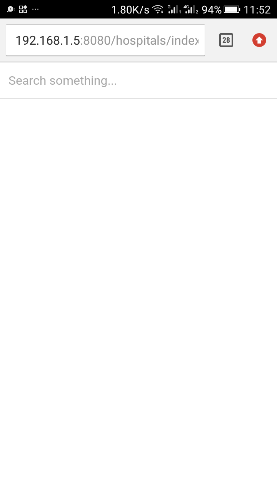
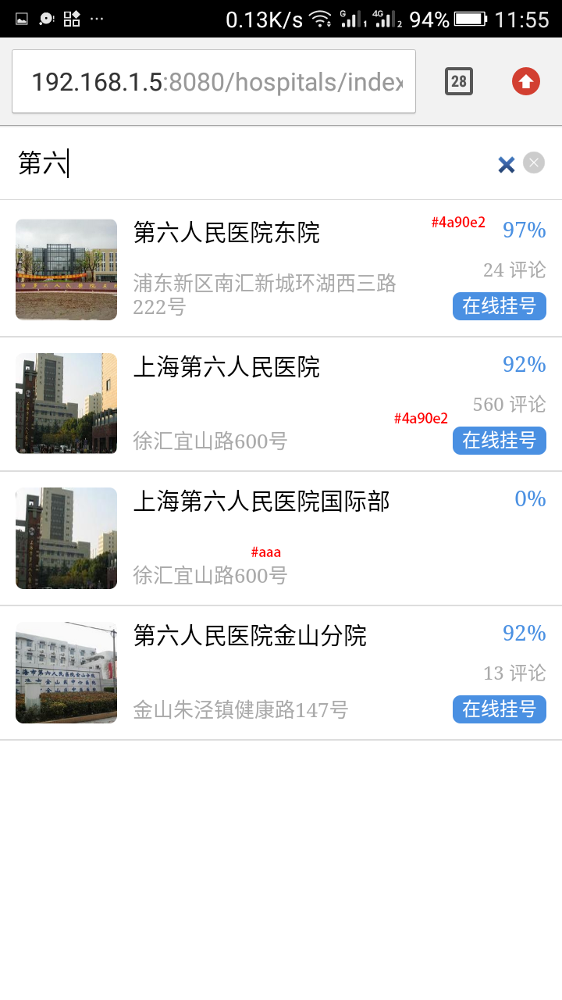
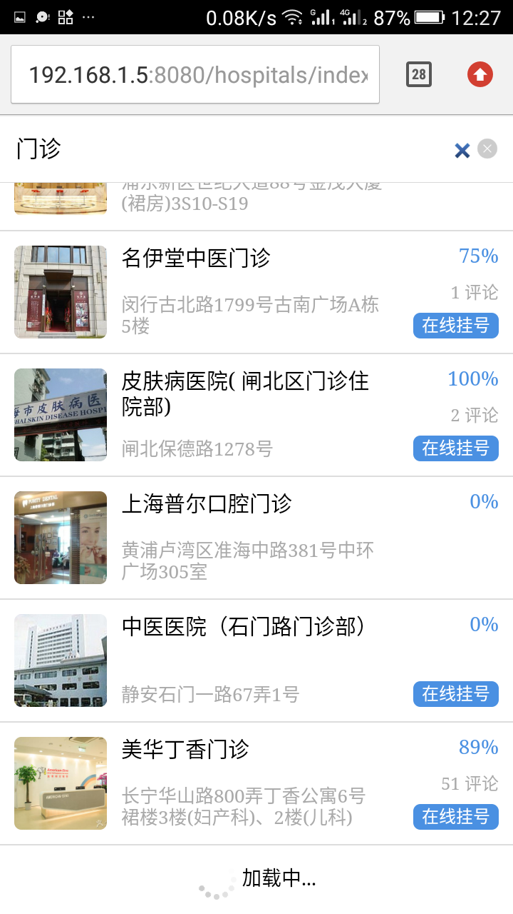
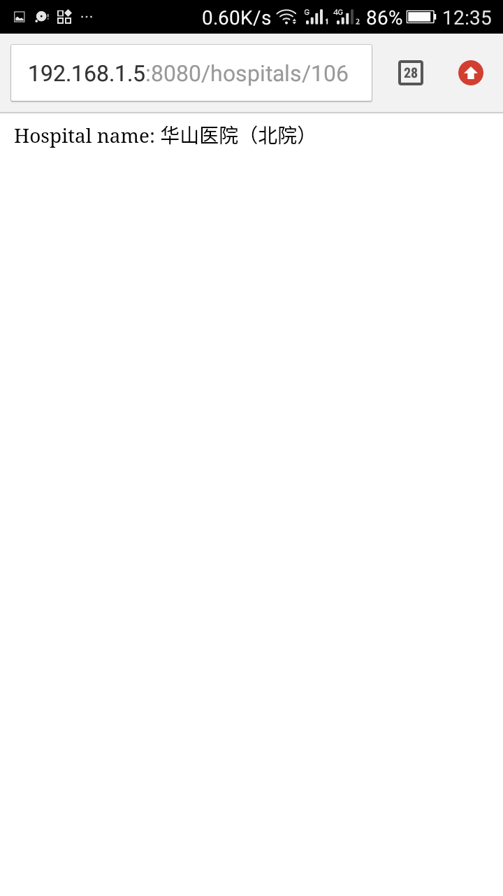

# 测试说明
该测试主要测试如何接入列表接口，实现列表界面。
初始的页面如下：

该页面对应的url为：http://localhost:8080/hospitals/index

# 问题1
接入获得医院列表的接口，根据搜索的关键字获取医院列表数据，并展示医院列表，效果如下图所示。


获得医院列表的接口：
```
POST http://staging.kangyu.co/v3/hospitals/search

Parameters:
query
  text 要搜索的关键字

Response:
hospitals
  id 医院ID
  name 医院名称
  address 医院地址
  big_cover 医院图片
  appointment_covered 布尔类型，是否可以预约
  reviews_count 评论数量
  reputation 评分

例：
curl -XPOST -H 'Content-Type: application/json' 'http://staging.kangyu.co/v3/hospitals/search' -d'
{
  "query": {
    "text": "第六"
  }
}
'
```

# 问题2
实现加载更多的功能，最终效果如下图所示。


# 问题3
接入获得医院详情的接口，实现点击列表中的医院，进入医院详情页的功能，医院详情页的效果如下图所示。


获得医院详情的接口：
```
GET http://staging.kangyu.co/v3/hospitals/:id

Response:
id 医院ID
name 医院名称
address 医院地址
big_cover 医院图片
appointment_covered 布尔类型，是否可以预约
reviews_count 评论数量
reputation 评分

例：
curl 'http://staging.kangyu.co/v3/hospitals/106'
```
